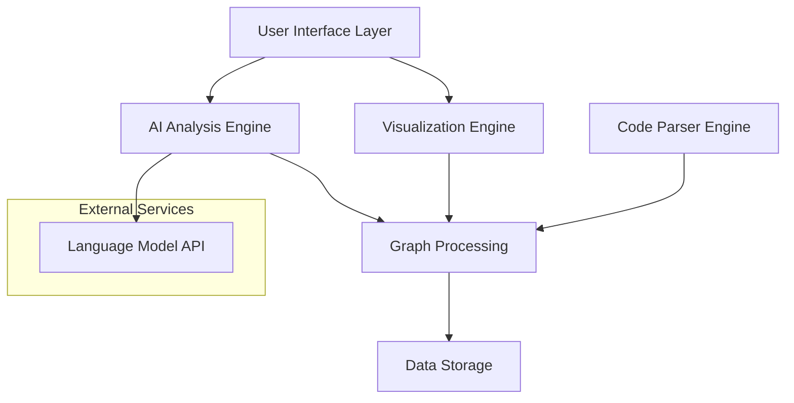

# Design Document: Ghost Architect

## Overview

Ghost Architect is an AI-powered codebase visualization tool that helps developers learn complex codebases through interactive system maps and intelligent explanations. The system combines static code analysis, graph visualization, and AI-powered insights to create an intuitive learning experience for junior developers and students.

The architecture follows a modular design with clear separation between code analysis, visualization rendering, AI processing, and user interface components. This enables extensibility for new programming languages and visualization techniques while maintaining performance and reliability.

## Architecture

The system uses a layered architecture with the following main components:



### Layer Responsibilities

1. **User Interface Layer**: Handles user interactions, file selection, and display coordination
2. **Visualization Engine**: Renders interactive system maps using D3.js or similar library
3. **AI Analysis Engine**: Processes code structure and generates insights using language models
4. **Code Parser Engine**: Analyzes source code files and extracts structural information
5. **Graph Processing**: Builds and maintains the dependency graph and relationships
6. **Data Storage**: Persists analysis results and user session data

## Components and Interfaces

### Code Parser Engine

**Purpose**: Extract structural information from source code files across multiple programming languages.

**Key Components**:
- `LanguageDetector`: Identifies programming language from file extensions and content
- `AbstractSyntaxTreeParser`: Generates ASTs for supported languages
- `DependencyExtractor`: Identifies imports, includes, and other dependencies
- `StructureAnalyzer`: Extracts functions, classes, and other structural elements

**Interfaces**:
```typescript
interface CodeParser {
  parseFile(filePath: string): Promise<ParsedFile>
  extractDependencies(file: ParsedFile): Dependency[]
  getSupportedLanguages(): string[]
}

interface ParsedFile {
  path: string
  language: string
  functions: FunctionInfo[]
  classes: ClassInfo[]
  imports: ImportInfo[]
  exports: ExportInfo[]
  complexity: number
  lineCount: number
}
```

### Graph Processing Engine

**Purpose**: Build and maintain the codebase dependency graph with relationship analysis.

**Key Components**:
- `DependencyGraphBuilder`: Constructs the directed graph from parsed files
- `ImportanceCalculator`: Computes centrality metrics and importance scores
- `PathFinder`: Traces data flow paths through the dependency graph
- `GraphOptimizer`: Reduces graph complexity for large codebases

**Interfaces**:
```typescript
interface GraphProcessor {
  buildGraph(files: ParsedFile[]): DependencyGraph
  calculateImportance(graph: DependencyGraph): ImportanceScores
  findDataFlowPaths(start: NodeId, end: NodeId): FlowPath[]
}

interface DependencyGraph {
  nodes: Map<NodeId, FileNode>
  edges: Map<EdgeId, DependencyEdge>
  getNeighbors(nodeId: NodeId): NodeId[]
  getShortestPath(from: NodeId, to: NodeId): NodeId[]
}
```

### AI Analysis Engine

**Purpose**: Generate intelligent insights about code importance, patterns, and learning recommendations.

**Key Components**:
- `ImportanceAnalyzer`: Uses multiple metrics to score file importance
- `PatternDetector`: Identifies common design patterns and architectural styles
- `ExplanationGenerator`: Creates natural language explanations using LLM
- `LearningPathOptimizer`: Suggests optimal exploration sequences

**Interfaces**:
```typescript
interface AIAnalyzer {
  analyzeImportance(file: ParsedFile, context: GraphContext): ImportanceAnalysis
  generateExplanation(component: CodeComponent, context: string): Promise<Explanation>
  suggestLearningPath(graph: DependencyGraph, userProgress: UserProgress): LearningPath
}

interface ImportanceAnalysis {
  score: number
  factors: ImportanceFactor[]
  reasoning: string
  category: 'core' | 'utility' | 'interface' | 'configuration'
}
```

### Visualization Engine

**Purpose**: Render interactive system maps with dynamic layouts and user interactions.

**Key Components**:
- `GraphRenderer`: Renders nodes and edges using SVG/Canvas
- `LayoutEngine`: Positions nodes using force-directed or hierarchical algorithms
- `InteractionHandler`: Manages user clicks, hovers, and gestures
- `FilterManager`: Applies visual filters and updates display

**Interfaces**:
```typescript
interface VisualizationEngine {
  renderGraph(graph: DependencyGraph, container: HTMLElement): void
  updateLayout(layoutType: LayoutType): void
  highlightPath(path: NodeId[]): void
  applyFilter(filter: GraphFilter): void
}

interface GraphFilter {
  fileTypes?: string[]
  importanceRange?: [number, number]
  directories?: string[]
  searchQuery?: string
}
```

## Data Models

### Core Data Structures

```typescript
// File representation after parsing
interface FileNode {
  id: string
  path: string
  name: string
  language: string
  size: number
  complexity: number
  importance: number
  functions: FunctionInfo[]
  classes: ClassInfo[]
  dependencies: string[]
  dependents: string[]
}

// Relationship between files
interface DependencyEdge {
  id: string
  source: string
  target: string
  type: 'import' | 'inheritance' | 'composition' | 'call'
  strength: number
  metadata: Record<string, any>
}

// AI-generated insights
interface Explanation {
  component: string
  summary: string
  details: string[]
  patterns: string[]
  suggestions: string[]
  confidence: number
}

// User learning progress
interface UserProgress {
  visitedFiles: Set<string>
  completedPaths: string[]
  bookmarks: string[]
  notes: Map<string, string>
  sessionTime: number
}
```

### Graph Algorithms

The system implements several graph algorithms for analysis:

1. **PageRank Algorithm**: Calculate file importance based on dependency relationships
2. **Betweenness Centrality**: Identify files that serve as bridges between components
3. **Strongly Connected Components**: Find circular dependencies and tight coupling
4. **Topological Sort**: Determine build order and dependency hierarchy

### AI Integration

The AI analysis leverages multiple approaches:

1. **Static Analysis Metrics**: Cyclomatic complexity, coupling, cohesion
2. **Graph Centrality Measures**: PageRank, betweenness, closeness centrality
3. **Pattern Recognition**: Common design patterns, architectural styles
4. **Natural Language Generation**: LLM-powered explanations and recommendations

## Error Handling

### Parser Error Recovery

- **Syntax Errors**: Skip malformed files and continue processing
- **Unsupported Languages**: Gracefully handle unknown file types
- **Large Files**: Implement streaming parsing for memory efficiency
- **Encoding Issues**: Detect and handle different character encodings

### Visualization Error Handling

- **Large Graphs**: Implement progressive loading and level-of-detail rendering
- **Browser Limitations**: Fallback to simpler visualizations on resource constraints
- **Layout Failures**: Provide alternative layout algorithms when primary fails
- **Performance Degradation**: Automatic quality reduction for smooth interaction

### AI Service Integration

- **API Failures**: Graceful degradation when AI services are unavailable
- **Rate Limiting**: Implement request queuing and retry mechanisms
- **Response Validation**: Verify AI-generated content for safety and relevance
- **Fallback Explanations**: Provide static explanations when AI is unavailable

## Testing Strategy

The testing approach combines unit tests for individual components with property-based tests for complex algorithms and integration tests for end-to-end workflows.

### Unit Testing Focus Areas

- **Parser Components**: Test language-specific parsing with known code samples
- **Graph Algorithms**: Verify correctness with small, well-defined graphs
- **UI Components**: Test user interactions and visual state management
- **Error Conditions**: Validate error handling and recovery mechanisms

### Property-Based Testing Applications

- **Graph Invariants**: Ensure graph operations maintain structural integrity
- **Parsing Consistency**: Verify that parsing and serialization are inverses
- **AI Explanation Quality**: Test that explanations are relevant and helpful
- **Performance Characteristics**: Validate that operations scale appropriately

### Integration Testing Scenarios

- **End-to-End Workflows**: Complete user journeys from file loading to insights
- **Cross-Language Support**: Test parsing and analysis across different languages
- **Large Codebase Handling**: Performance testing with real-world repositories
- **AI Service Integration**: Test resilience to external service failures

## Correctness Properties

*A property is a characteristic or behavior that should hold true across all valid executions of a system—essentially, a formal statement about what the system should do. Properties serve as the bridge between human-readable specifications and machine-verifiable correctness guarantees.*

### Property 1: Comprehensive File Processing
*For any* valid codebase directory, the system should successfully parse all supported files, extract structural information (functions, classes, imports, dependencies), skip unsupported files without errors, and continue processing despite individual file parsing failures.
**Validates: Requirements 1.1, 1.2, 1.3, 1.4**

### Property 2: Language Support Completeness
*For any* source file in JavaScript, TypeScript, Python, Java, or C#, the system should correctly identify the language and extract appropriate structural elements.
**Validates: Requirements 1.5**

### Property 3: Graph Visualization Completeness
*For any* analyzed codebase, the generated system map should contain exactly one node per successfully parsed file and directed edges that accurately represent all dependency relationships.
**Validates: Requirements 2.1, 2.2, 2.3**

### Property 4: Hierarchical Layout Preservation
*For any* directory structure, the visual layout should maintain the hierarchical organization where files in the same directory are visually grouped and nested directories are represented as sub-groups.
**Validates: Requirements 2.4**

### Property 5: Universal Importance Scoring
*For any* analyzed file, the AI system should calculate an importance score considering dependency count, file size, complexity, and centrality, and provide reasoning for the score calculation.
**Validates: Requirements 3.1, 3.4, 3.5**

### Property 6: Visual Importance Correlation
*For any* two files with different importance scores, the file with the higher score should have a more prominent visual representation (larger node size or higher color intensity).
**Validates: Requirements 3.2**

### Property 7: Data Flow Tracing Completeness
*For any* valid starting point in the codebase, the system should trace and highlight complete data flow paths, showing the sequence of function calls and providing AI explanations for each step.
**Validates: Requirements 4.1, 4.2, 4.4**

### Property 8: Interactive Response Consistency
*For any* user interaction (clicking nodes, hovering over connections), the system should respond by displaying relevant detailed information and visual feedback within a reasonable time frame.
**Validates: Requirements 5.1, 5.2, 5.3**

### Property 9: Filter Application Correctness
*For any* applied filter (file type, importance level, directory), the visualization should update to show only elements matching the filter criteria and update in real-time.
**Validates: Requirements 5.4, 5.5**

### Property 10: AI Explanation Comprehensiveness
*For any* component explanation request, the AI system should provide context-aware insights, identify design patterns when present, explain architectural roles, and suggest relevant learning paths.
**Validates: Requirements 6.1, 6.2, 6.3, 6.4**

### Property 11: Learning Path Optimization
*For any* codebase exploration session, the AI system should suggest learning sequences that consider file importance and dependency relationships, adapt based on user progress, and provide reasoning for each recommendation.
**Validates: Requirements 7.1, 7.2, 7.3, 7.4, 7.5**

### Property 12: Export Format Completeness
*For any* system map export request, the system should generate files in the requested format (PNG, SVG, PDF) that preserve the visual layout, annotations, and include any associated learning notes and AI explanations.
**Validates: Requirements 8.1, 8.2, 8.5**

### Property 13: State Persistence Round-Trip
*For any* saved map configuration or shareable link, loading the saved state should restore the exact view configuration, filter settings, and user annotations that were present when saved.
**Validates: Requirements 8.3, 8.4**

## Testing Strategy

The testing approach combines unit tests for individual components with property-based tests for complex algorithms and integration tests for end-to-end workflows.

### Unit Testing Focus Areas

**Parser Components**: Test language-specific parsing with known code samples including edge cases like empty files, syntax errors, and unusual formatting. Verify that each supported language correctly identifies functions, classes, imports, and dependencies.

**Graph Algorithms**: Verify correctness of importance calculation, centrality measures, and path finding with small, well-defined graphs. Test edge cases like circular dependencies, isolated nodes, and very large graphs.

**UI Components**: Test user interactions including clicks, hovers, filtering, and zoom/pan operations. Verify that visual state updates correctly and error states are handled gracefully.

**AI Integration**: Test API integration with mock responses, error handling for service failures, and fallback behavior when AI services are unavailable.

### Property-Based Testing Applications

**Graph Invariants**: Ensure that graph operations maintain structural integrity - adding nodes preserves existing relationships, removing nodes properly updates dependencies, and graph transformations don't create invalid states.

**Parsing Consistency**: Verify that parsing operations are deterministic and that structural information extraction is consistent across multiple runs of the same file.

**AI Explanation Quality**: Test that explanations are relevant to the requested component, contain expected information types, and maintain consistent quality across different code patterns.

**Performance Characteristics**: Validate that operations scale appropriately with codebase size and that memory usage remains within acceptable bounds for large repositories.

### Integration Testing Scenarios

**End-to-End Workflows**: Complete user journeys from loading a codebase through generating insights and exporting results. Test with real-world repositories of varying sizes and complexity.

**Cross-Language Support**: Test parsing and analysis across different programming languages within the same codebase, ensuring consistent behavior and accurate cross-language dependency detection.

**Large Codebase Handling**: Performance testing with repositories containing thousands of files, ensuring the system remains responsive and memory usage is reasonable.

**AI Service Integration**: Test resilience to external service failures, rate limiting, and varying response times from language model APIs.

### Property-Based Test Configuration

Each property test should run a minimum of 100 iterations to ensure comprehensive coverage through randomization. Tests should be tagged with comments referencing their corresponding design document properties using the format: **Feature: ghost-architect, Property {number}: {property_text}**.

The testing framework should generate diverse inputs including:
- Various codebase structures and sizes
- Different programming language combinations  
- Edge cases like empty directories and malformed files
- Different user interaction patterns and sequences
- Various AI service response scenarios

Both unit tests and property tests are essential for comprehensive coverage - unit tests catch specific bugs and edge cases while property tests verify general correctness across the input space.